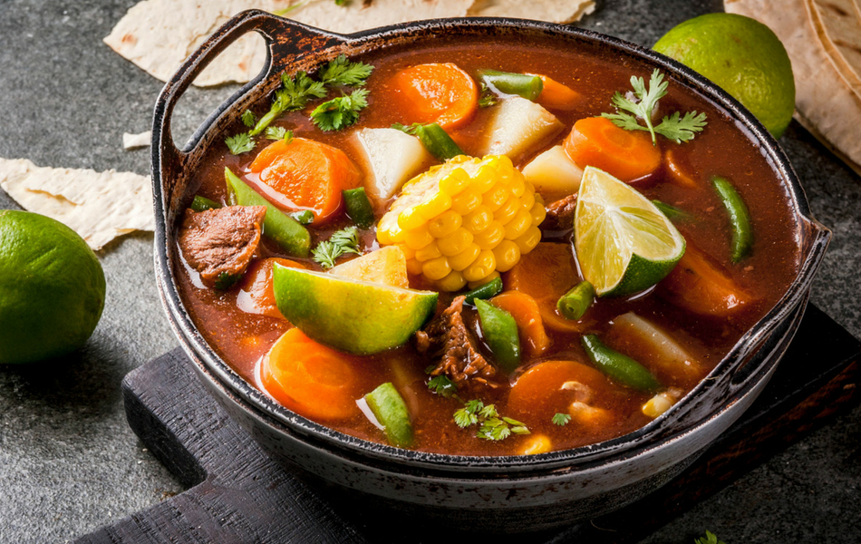

<a name="top"></a>


<div align="center">
<h1>** Titulo de la receta **</h1>
</div>


<details>
  <summary>Indice de nuesto menú</summary>
  <ol>
    <li>
      <a href="#ing">Ingredientes</a>
    </li>
    <li>
      <a href="#proc">Procedimiento</a>
      <ul>
          <li>titulo Paso 1</li>
          <li>titulo Paso 2</li>
          <li>titulo Paso 3</li>
      </ul>
    </li>
    <li><a href="#galeria">Galería de imagenes</a></li>
    <li><a href="#retos">Los retos que enfrentamos como equipo :</a>
      <ul>
          <li>Integrante 1</li>
          <li>Integrante 2</li>
          <li>Integrante 3</li>
          <li>Integrante 4</li>
      </ul>
    </li>
  </ol>
</details>


<div align="center">    
<a name="ing"></a>
<h1> Ingredientes </h1>
  
  ```sh
  
| Ingrediente           | Cantidad          | 
| -----------------     | ---------------   | 
| 1.- ingrediente       | 3 pzas            | 
| 2.- ingrediente       | 5 oz              | 
| 3.- ingrediente       | 3 cdas            | 
| 4.- ingrediente       | 3 pzas            | 
 
  
  ```
  
</div>

<div>
   <a name="proc"></a>
 <h1> Procedimiento </h1>
 
 <h3>paso 1</h3>
    
  ```sh
 poner algo en la olla
 
  
  ```
  
 <h3>paso 2</h3>
 
 ```sh
 poner algo en la olla
 
  ```
 <h3>paso 3</h3>

```sh
 poner algo en la olla
 
  
  ```
<div>
  
<div align="center">
<a name="galeria"></a>
<h1>Galeria de imagenes</h1>  


  
  
</div>

<div align="center">
<a name="retos"></a>
<h1>Retos</h1>  
<div align="left">
  <p>pedro: </p>
  <p>juan: </p>
  <p>miguel: </p>
  <p>pancho: </p> 
</div>
</div>


<p align="right">(<a href="#top">Volver al menu</a>)</p>


