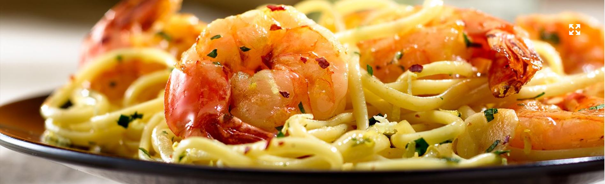
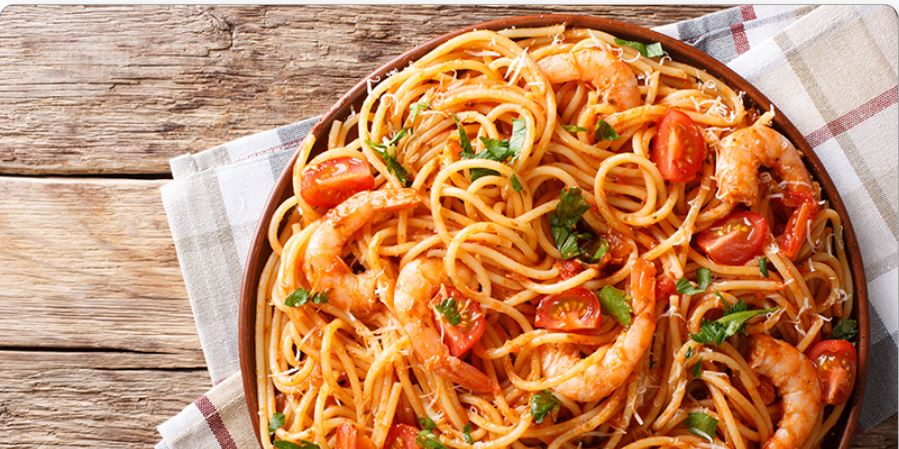
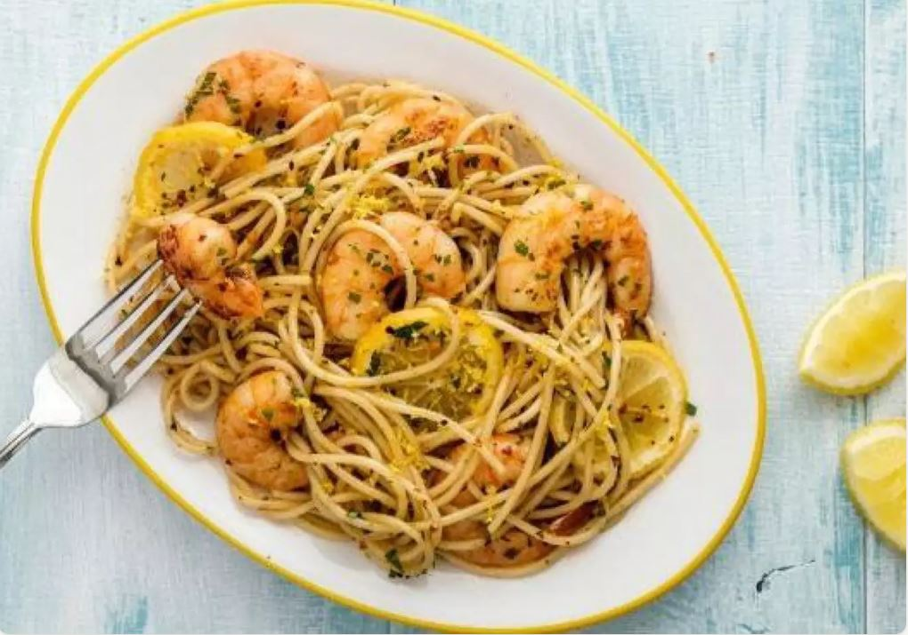
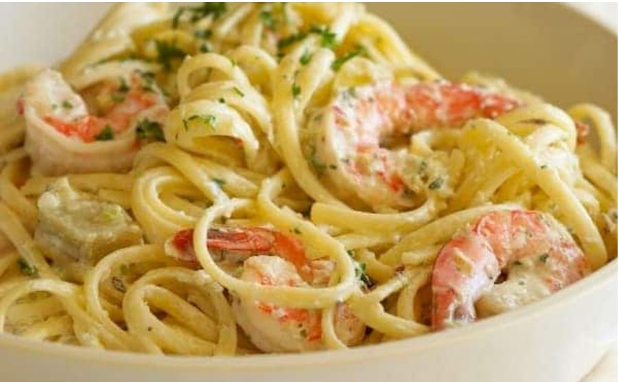
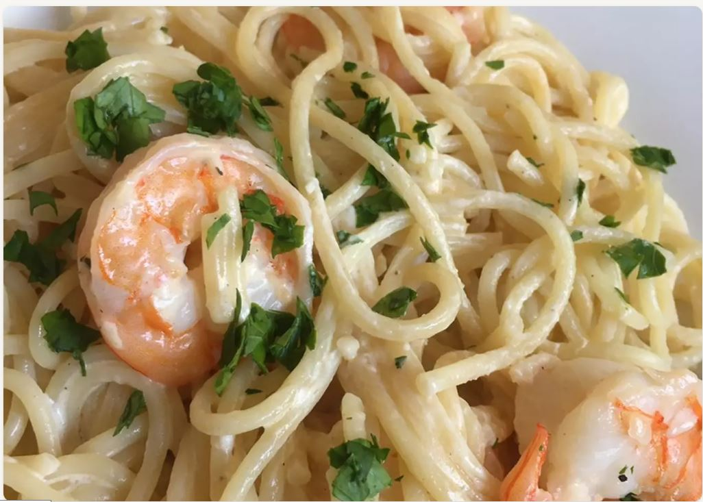

<a name="top"></a>


<div align="center">
<h1>** PASTA DE CAMARONES **</h1>
</div>


<details>
  <summary>Indice de nuesto menú</summary>
  <ol>
    <li>
      <a href="#ing">Ingredientes</a>
    </li>
    <li>
      <a href="#proc">Procedimiento</a>
      <ul>
          <li>1.- Calienta</li>
          <li>2.- Licúa</li>
          <li>3.- Saltea</li>
      </ul>
    </li>
    <li><a href="#galeria">Galería de imagenes</a></li>
    <li><a href="#retos">Los retos que enfrentamos como equipo :</a>
      <ul>
          <li>Uriel Vera</li>
          <li>Josue Colin</li>
          <li>Marco Angeles</li>
          <li>Fernando Tapia</li>
          <li>Integrante 5</li>
          <li>Integrante 6</li>
          <li>Integrante 7</li>
          <li>Integrante 8</li>
      </ul>
    </li>
  </ol>
</details>


<div align="center">    
<a name="ing"></a>
<h1> Ingredientes </h1>
  
  ```sh
  
| Ingrediente                                | Cantidad                 | 
| ----------------------------               | ---------------          | 
| 1.- Lata de leche Evaporada CARNATION      | 1 lata                   | 
| 2.- Ajo en polvo                           | 1 cucharada              | 
| 3.- Consome de pollo                       | 1 cubo                   | 
| 4.- Paquete de pasta                       | 1 paquete                | 
| 5.- Aceite de maiz                         | 1 cucharada              | 
| 6.- Camarones cocidos                      | 250 gramos               | 
|         (sin cabeza pelados y limpios)     |                          | 
| 7.- Queso crema                            | 190 gramos               | 
| 8.- Agua                                   | 1 taza                   | 
  
  ```
  
</div>

<div>
   <a name="proc"></a>
 <h1> Procedimiento </h1>
 
 <h3>Calienta</h3>
    
  ```sh
 1.- Calienta el aceite en una sartén y fríe los camarones
 
  
  ```
  
 <h3>Licúa</h3>
 
 ```sh
 2.- Para la salsa, licúa el queso crema con al Leche Evaporada CARNATION, el cubo de consomé de pollo, ajo en polvo y el agua
 

  ```
 <h3>Saltea</h3>

```sh
3.- Coloca en una sartén el spaguetti, previamente cocido y escurrido, y los camarones
 

 4.- agrega la salsa, mezcla y calienta por 5 minutos. Ofrece. y...

  ¡Disfruta!
  ```
<div>
  
<div align="center">
<a name="galeria"></a>
<h1>¡Galeria de imagenes con pastas de muchos paises da click en ellas!</h1>  
<a title="Europa" href="https://ayeryhoyrevista.com/el-origen-de-la-pasta-en-europa/"></a>
<a title="Asia" href="https://www.cocinista.es/web/es/enciclopedia-cocinista/ingredientes-del-mundo/pastas-asiaticas.html"></a>
<a title="EUA" href="https://eldiariony.com/2021/11/03/los-platillos-de-pasta-mas-famosos-en-estados-unidos/"></a>
<a title="Mexico" href="https://www.mexicoenmicocina.com/sopas/pastas/"></a> 
<a title="Italia" href="https://www.traveler.es/gastronomia/articulos/los-mejores-platos-de-pasta-de-italia/5280"></a>
</div>

<div align="center">
<a name="retos"></a>
<h1>Retos</h1>  
<div align="left">
  <p>Marco: "Primer experiencia en la programación, un nuevo reto para mi, pero con la ayuda de comandos actuales, es mucho mas fácil que lo que alguna vez yo estudie" </p>
  <p>Geddiel: Aprender al nuevo y poder aplicarlo es sumamente satisfactorio.</p>
  <p>miguel: </p>
  <p>pancho: </p> 
</div>
</div>
  
  
<h3 align="center">¡¡ Dale click a la imagen y mira la magia !!</h3>
  
[](https://www.youtube.com/watch?v=8BaCHL0zKLU)


<p align="right">(<a href="#top">Volver al menu</a>)</p>


